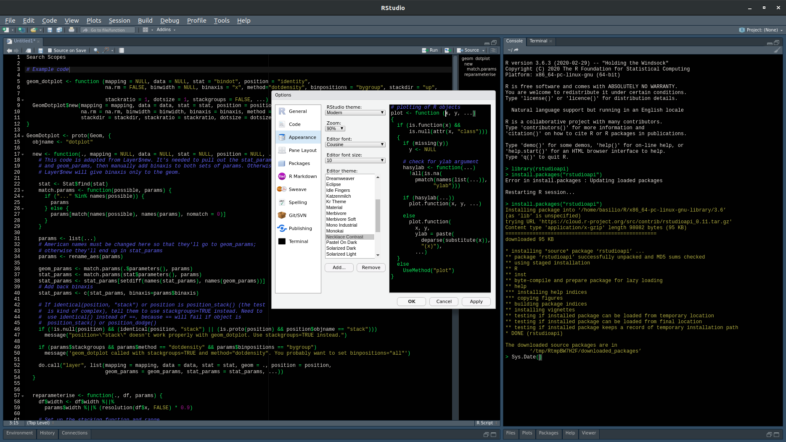

# r-custom

Personal theme for customizing RStudio.  

The styling file found in this reposirory can be installed using:
```{r}
rstudioapi::addTheme(themePath = "necklace_contrast.rstheme", apply = TRUE)
```


Notes on how to edit a `.rstheme` file (an RStudio-oriented CSS format) can be found [here](https://rstudio.github.io/rstudio-extensions/rstudio-theme-creation.html).
